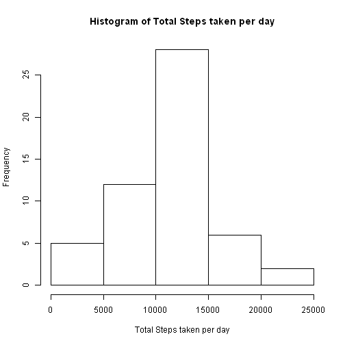
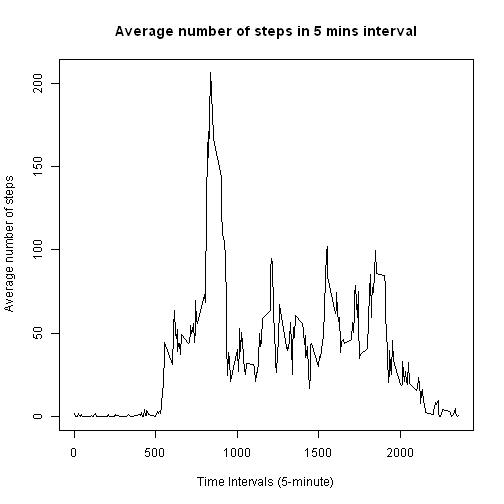
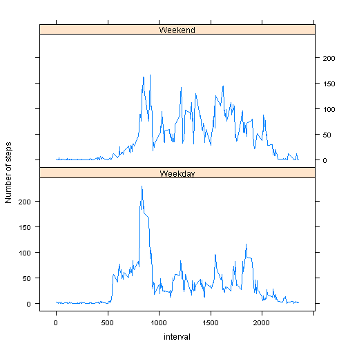

**This is an R Markdown document for Reproducible Research: Peer Assesment 1** 

**Assignment Introduction**

It is now possible to collect a large amount of data about personal movement using activity monitoring devices such as a Fitbit, Nike Fuelband, or Jawbone Up. These type of devices are part of the "quantified self" movement - a group of enthusiasts who take measurements about themselves regularly to improve their health, to find patterns in their behavior, or because they are tech geeks. But these data remain under-utilized both because the raw data are hard to obtain and there is a lack of statistical methods and software for processing and interpreting the data.

This assignment makes use of data from a personal activity monitoring device. This device collects data at 5 minute intervals through out the day. The data consists of two months of data from an anonymous individual collected during the months of October and November, 2012 and include the number of steps taken in 5 minute intervals each day.

**Loading and preprocessing the data**


```r
#Load package
library(lattice)

#Read the data
activity_data <- read.csv("~/R Workspace/repdata-data-activity/activity.csv")

#Remove the NA's and assign to a new dataset 
activity_data_nan <- na.omit(activity_data)
```
**Calculate the mean of total number of steps taken per day**

```r
#Calculate the total no of steps taken
totalSteps <- aggregate(steps ~ date, data = activity_data_nan, sum)
#Plot histogram
hist(totalSteps$steps,main="Histogram of Total Steps taken per day",xlab="Total Steps taken per day")
```

 

```r
#calculate the mean & median
mean_totalSteps <- mean(totalSteps$steps)
print(paste("Mean=",mean_totalSteps))
```

```
## [1] "Mean= 10766.1886792453"
```

```r
median_totalSteps <- median(totalSteps$steps)
print(paste("Median=",median_totalSteps))
```

```
## [1] "Median= 10765"
```
**Calculate the average daily activity pattern**

```r
#Calculate the average daily steps by interval
avg_interval <- aggregate(steps ~ interval, data = activity_data_nan, mean)
#plot the average daily activity pattern
plot(avg_interval,type="l",xlab = "Time Intervals (5-minute)", ylab = "Average number of steps", main = "Average number of steps in 5 mins interval")
```

 

```r
#Calculate the max number of steps in 5 mins interval
max_interval<- avg_interval[which.max(avg_interval$steps),"interval"]
max_steps<- max(avg_interval$steps)
print(paste(max_interval,"is the time interval which has the highest no of steps with of value", max_steps))
```

```
## [1] "835 is the time interval which has the highest no of steps with of value 206.169811320755"
```

**Imputing missing values**

Creating a new subset of data which contains NA value for the steps. The NA values are replaced with the mean for that 5-minute interval. The subset is later combined with the subset of data where the NA values were removed. 

```r
#Calculate the records with NA
activity_data_na <- activity_data[which(is.na(activity_data)),]
activity_data_na_count <- length(which(is.na(activity_data)))

print(paste("total number of rows with NAs =",activity_data_na_count))
```

```
## [1] "total number of rows with NAs = 2304"
```

```r
#Fill the NA's with mean of the 5-minute interval
for (i in 1:nrow(activity_data_na)) {
  if(activity_data_na$interval==avg_interval$interval) activity_data_na$steps <- avg_interval$steps
}

#combine the dataset 
full_activity_data <- rbind(activity_data_nan,activity_data_na)

#plot the new histogram for full dataset
totalSteps_Full <- aggregate(steps ~ date, data = full_activity_data, sum)
hist(totalSteps_Full$steps,main="Histogram of Total Steps taken per day",xlab="Total Steps taken per day")
```

 

```r
#calculate the mean & median
mean_totalSteps_Full <- mean(totalSteps_Full$steps)
print(paste("Mean =", mean_totalSteps))
```

```
## [1] "Mean = 10766.1886792453"
```

```r
median_totalSteps_Full <- median(totalSteps_Full$steps)
print(paste("Median=",median_totalSteps))
```

```
## [1] "Median= 10765"
```
The values of mean and median from the dataset without NA values and dataset after imputing the NA values do not differ much. 
There is not much of impact in imputing missing data on the estimates of the total daily number of steps

**Activity patterns between weekdays and weekends**

```r
#Convert to date format
full_activity_data$date <- as.POSIXlt(full_activity_data$date,format="%Y-%m-%d")
#Create and populate the day type (dtype) field with day of the week
full_activity_data$dtype<- weekdays(full_activity_data$date,abbreviate = TRUE)
#Check and replace the populated day of the week to either weekday or weekend
full_activity_data$dtype<- ifelse(full_activity_data$dtype == "Sat" | full_activity_data$dtype == "Sun", "Weekend", "Weekday")

#Convert the (dtype) column to a factor
full_activity_data$dtype <- as.factor(full_activity_data$dtype)
#Calculate the average steps taken during weekend and weekdays
dtype_mean <- aggregate(steps ~ interval+dtype, full_activity_data, mean)

#Plot the graph
xyplot(steps ~ interval | dtype, data = dtype_mean, layout = c(1, 2), type = "l", ylab = "Number of steps")
```

 
